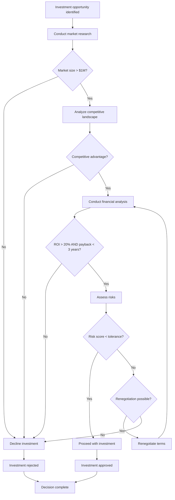

```mermaid
flowchart TD
    A[Investment opportunity identified] --> B[Conduct market research]
    B --> C{Market size > $1M?}
    C -->|No| D[Decline investment]
    C -->|Yes| E[Analyze competitive landscape]
    E --> F{Competitive advantage?}
    F -->|No| D
    F -->|Yes| G[Conduct financial analysis]
    G --> H{ROI > 20% AND payback < 3 years?}
    H -->|No| D
    H -->|Yes| I[Assess risks]
    I --> J{Risk score < tolerance?}
    J -->|Yes| K[Proceed with investment]
    J -->|No| L{Renegotiation possible?}
    L -->|Yes| M[Renegotiate terms]
    M --> G
    L -->|No| D
    K --> N[Investment approved]
    D --> O[Investment rejected]
    N --> P[Decision complete]
    O --> P
```