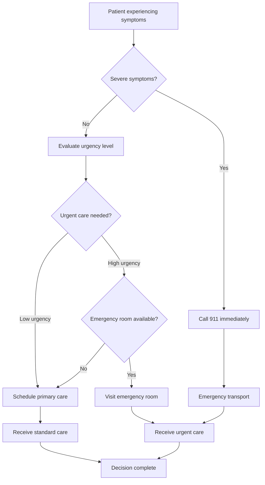

```mermaid
flowchart TD
    A[Patient experiencing symptoms] --> B{Severe symptoms?}
    B -->|Yes| C[Call 911 immediately]
    B -->|No| D[Evaluate urgency level]
    C --> E[Emergency transport]
    D --> F{Urgent care needed?}
    F -->|High urgency| G{Emergency room available?}
    F -->|Low urgency| H[Schedule primary care]
    G -->|Yes| I[Visit emergency room]
    G -->|No| H
    H --> J[Receive standard care]
    I --> K[Receive urgent care]
    E --> K
    J --> L[Decision complete]
    K --> L
```