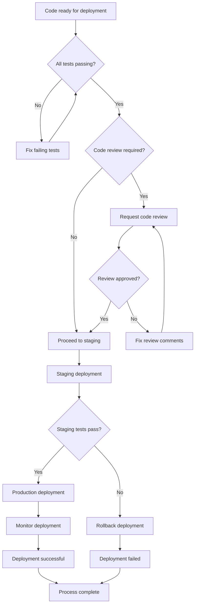

```mermaid
flowchart TD
    A[Code ready for deployment] --> B{All tests passing?}
    B -->|No| C[Fix failing tests]
    C --> B
    B -->|Yes| D{Code review required?}
    D -->|Yes| E[Request code review]
    D -->|No| F[Proceed to staging]
    E --> G{Review approved?}
    G -->|No| H[Fix review comments]
    H --> E
    G -->|Yes| F
    F --> I[Staging deployment]
    I --> J{Staging tests pass?}
    J -->|No| K[Rollback deployment]
    J -->|Yes| L[Production deployment]
    L --> M[Monitor deployment]
    M --> N[Deployment successful]
    K --> O[Deployment failed]
    N --> P[Process complete]
    O --> P
```